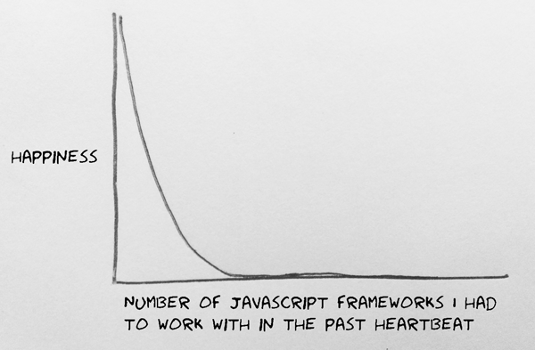

# Mozilla Foundation Engineering Handbook

Webmaker is a part of Mozilla's non-profit mission to create a more open, web literate world. One of the many important parts of the Webmaker effort is the software we build. We build it with the hopes of enabling creation and expression on the web, facilitate learning about the web through a fun experience.

The origins of the various pieces of software that make up Webmaker is at least as storied and diverse as those who built it. -- A team of talented, motivated employees and volunteers. Each project has had some strengths and opinions, but we lacked a coherent opinion of how we build software. Without this stated opinion we lack the ability to learn from our mistakes and build on our successes.

It can also suck to work on projecs with different defficiencies:

Contained within this book is a guide to how we write software and how you can help. This is and will always be a work-in-progress. We're always open to new ideas, tools and strategies.

This book is split into four distinct volumes:

* [Onboarding &mdash; Start here if you're new to Webmaker projects](onboarding/README.md)
* [Who We're Building For](personas.md)
* [Principles of Software Development](principles/README.md)
* [Our Toolset](tech/README.md)

_If you'd like to start a discussion about this book, file a new issue [on this repository](https://github.com/MozillaFoundation/MoFo-Engineering-Handbook/issues/new) _. We can help each other work towards a proposal in the form of a Pull Request.
